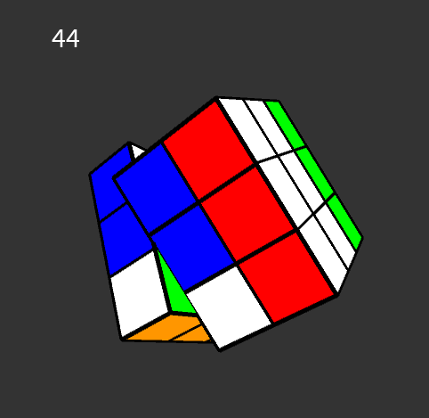
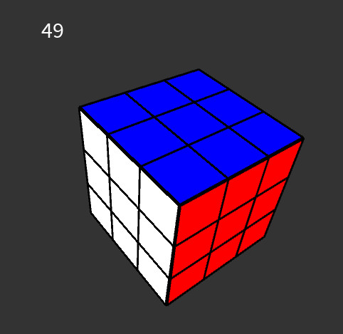

# Rubik's Cube Solver using Processing

<!--  -->

## Table of Contents
- [Introduction](#introduction)
- [Features](#features)
- [Demo](#demo)
- [Installation](#installation)
- [Usage](#usage)
- [Dependencies](#dependencies)
- [Contributing](#contributing)
- [License](#license)

## Introduction
The Rubik's Cube Solver is an interactive and visually captivating project developed using the Processing programming language. This solver aims to provide an automated solution to solve the classic Rubik's Cube puzzle. It offers a 3D visualization of the cube's movements as it rearranges itself to reach the solved state.

## Features
- 3D visualization of a Rubik's Cube in a 3x3x3 grid
- Automated solving algorithm using pre-defined moves
- Interactive camera control with PeasyCam library
- Engaging and captivating animations

## Demo
- [ ] TODO: ADD DEMO GIF
<!--  -->

## Installation
1. Make sure you have [Processing](https://processing.org/) and [Java SDK 17](https://openjdk.java.net/projects/jdk/17/) installed on your system.
2. Clone this repository or download the ZIP file and extract it.

## Usage
1. Open the Processing IDE and load the project.
2. Click the "Play" button or press `Ctrl + R` to run the Rubik's Cube Solver.
3. Explore the 3D Rubik's Cube by dragging the mouse to change the view.
4. Watch the automated solver in action as it solves the scrambled cube.

## Dependencies
The project relies on the following library:
- [PeasyCam](https://mrfeinberg.com/peasycam/): A camera control library for 3D visualization in Processing.

## Contributing
Contributions are welcome! If you find any issues or have ideas for improvements, feel free to open an issue or create a pull request.

## License
This project is licensed under the [MIT License](LICENSE).

---

Have fun exploring and solving the Rubik's Cube using our mesmerizing 3D Processing solver!
